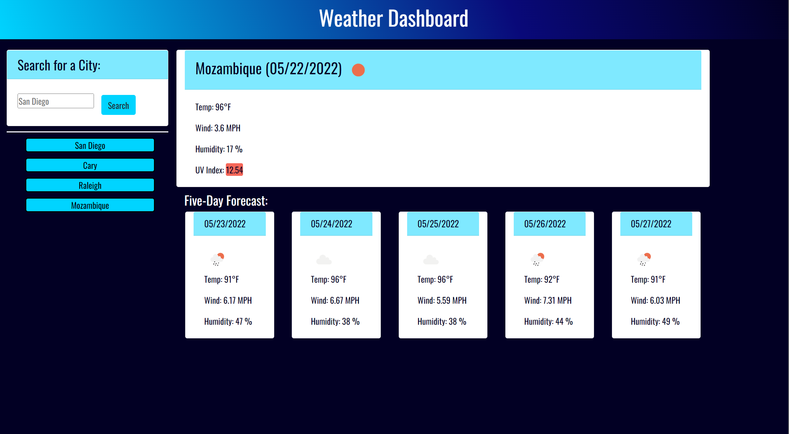

# Weather-Dashboard

## Description
This project was created to show the user the weather outlook for multiple cities so that they can plan a trip accordingly. This is done by fulfilling the following requirements:
* When the user searches for a city, they are presented with current and future conditions for that city and it is added to the search history.
* When the user views the current weather conditions for a city, they are presented with the city name, the date, an icon representation of the weather conditions, the temperature, the humidity, the wind speed, and the UV index.
* When the user views the UV index, they are presented with a color that tells them if the conditions are favorable, moderate, or severe.
* When the user views future weather conditions for a city, they are presented with a 5-day forecast that displays the date, an icon representation of weather conditions, the temperature, the wind speed, and the humidity.
* When the user clicks on a city in the search history, they are again presented with current and future conditions for that city.

## Table of Contents (Optional)
- [Installation](#installation)
- [Links](#links)
- [Usage](#usage)
- [Creation](#creation)
- [License](#license)
- [Project-status](#project-status)

## Installation
The repository, Weather-Dashboard, was created and cloned from GitHub. An index.html file was created and coded to contain the site content (without any weather information displaying). A folder, assets, was created to house three folders: css, images, and js. The css folder contains the style sheet, style.css, which was created and coded to contain the site formatting and design. The images folder contains a screenshot of the live site, a screenshot of the mockup, and an additional folder, icons, for all of the weather icons. The js folder contains the script sheet, script.js, which was created and coded to allow the site to be dynamic.

## Links
- [GitHub Repository](https://github.com/amklenk/Weather-Dashboard)
- [GitHub Pages Site](https://amklenk.github.io/Weather-Dashboard/)

## Usage

Below is a screenshot of the live site, with four searched cities shown:

The site should be navigable via clicking the submit button and then each city button to see the current and 5-day forecast for each respective city.

## Creation
Each of the requirements were fulfilled:
* When the user searches for a city, they are presented with current and future conditions for that city and it is added to the search history.
* When the user views the current weather conditions for a city, they are presented with the city name, the date, an icon representation of the weather conditions, the temperature, the humidity, the wind speed, and the UV index.
* When the user views the UV index, they are presented with a color that tells them if the conditions are favorable, moderate, or severe.
* When the user views future weather conditions for a city, they are presented with a 5-day forecast that displays the date, an icon representation of weather conditions, the temperature, the wind speed, and the humidity.
* When the user clicks on a city in the search history, they are again presented with current and future conditions for that city.

Once the repository was stored locally, the HTML, CSS, and JS files were created in their respective folders.

The boilerplate HTML was created first. It contains the header, card with the input form, and the CDNs for Google Fonts, Moment.js, Bootstrap, and jQuery. Any dynamic content was hard coded and then removed to be dynamically rendered with the JS file. The CSS styling sheet was coded with additional selectors on top of the Bootstrap styling within the HTML code. The styling sheet is organized by where each element appears in the HTML code and is then organized by element, by class, and then by id.

The JS code was organized to have the selector variables at the top and then the functions underneath them, with an event handler that uses jQuery at the bottom. The functions are listed in order of their functionality as the user interacts with the site. The formSubmitHandler function handles the user submission, a city name. The inputCity function takes that submission and finds the latitude and longitude of the city using the Geocoding API (from OpenWeatherMap). The latitude and longitude are then passed to the getWeatherInfo function, which finds the current weather and forecast data from the OneCall API (also from OpenWeatherMap). The displayWeather function then renders all of the dynamic items (the current weather, the 5-day forecast, and the buttons). The saveCity function creates an array of the city names and saves them to local storage. The loadCity function loads the city names from the saved array and passes them through the inputCity function to load the weather and buttons. The event handler targets each city button to show the current weather and 5-day forecast for that city when the user clicks them by passing each city name to the inputCity function.

## License
MIT License

Copyright (c) [2022] [Amanda Klenk]

Permission is hereby granted, free of charge, to any person obtaining a copy
of this software and associated documentation files (the "Software"), to deal
in the Software without restriction, including without limitation the rights
to use, copy, modify, merge, publish, distribute, sublicense, and/or sell
copies of the Software, and to permit persons to whom the Software is
furnished to do so, subject to the following conditions:

The above copyright notice and this permission notice shall be included in all
copies or substantial portions of the Software.

THE SOFTWARE IS PROVIDED "AS IS", WITHOUT WARRANTY OF ANY KIND, EXPRESS OR
IMPLIED, INCLUDING BUT NOT LIMITED TO THE WARRANTIES OF MERCHANTABILITY,
FITNESS FOR A PARTICULAR PURPOSE AND NONINFRINGEMENT. IN NO EVENT SHALL THE
AUTHORS OR COPYRIGHT HOLDERS BE LIABLE FOR ANY CLAIM, DAMAGES OR OTHER
LIABILITY, WHETHER IN AN ACTION OF CONTRACT, TORT OR OTHERWISE, ARISING FROM,
OUT OF OR IN CONNECTION WITH THE SOFTWARE OR THE USE OR OTHER DEALINGS IN THE
SOFTWARE.

## Project Status

This project is a work in progress. The layout and its responsiveness need to be better tweaked with Bootstrap and special additional CSS styling.